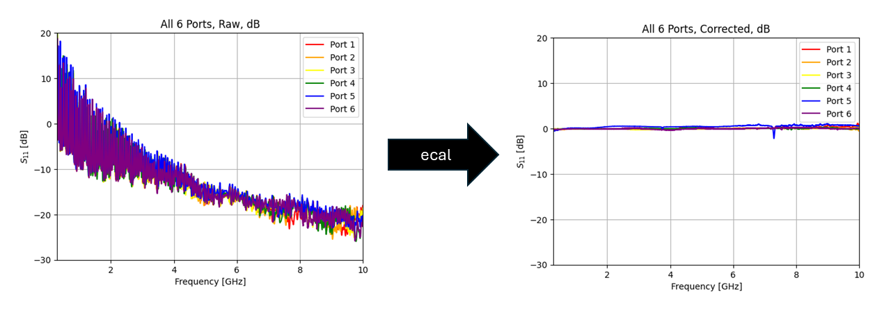

# [mm4250-ecal](https://github.com/lafefspietz/mm4250-ecal)
This repository is created to assist end users through the process of performing single-ended calibration using the MM4250 MEMS-based radio frequnecy cryogenic switch.

This project is streamlined from the full data set: [https://github.com/lafefspietz/nist_MM4250_calibration_data_2025](https://github.com/lafefspietz/nist_MM4250_calibration_data_2025).

## Start Here
### ---> [ecal.ipynb](ecal.ipynb) <---

## Default Data
 - [nist-mm4250-ideals.zip](assets/nist-mm4250-ideals.zip)
 - [example-mydata.zip](assets/example-rawdata.zip)

The ideal and example data files provided in the project by default are from the IEEE Journal of Microwaves paper [Cryogenic RF MEMS Switch With Electronic Calibration Capability](https://doi.org/10.1109/JMW.2025.3638273), which was created as part of a collaboration between [NIST](https://www.nist.gov/), [Menlo Micro](https://menlomicro.com/), and [FormFactor](https://www.formfactor.com/).