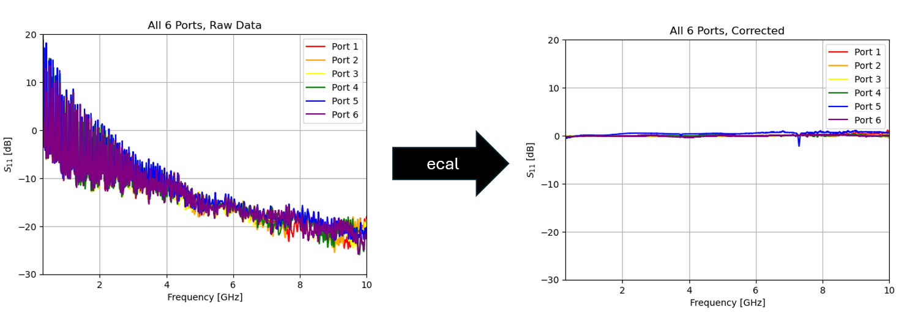

# [mm4250-ecal](https://github.com/lafefspietz/mm4250-ecal)

## [Start here: ecal.ipynb](ecal.ipynb) 

 - [nist-mm4250-ideals.zip](nist-mm4250-ideals.zip)
 - [example-mydata.zip](example-mydata.zip)

Documentation for performing calibration using the MM4250 MEMS-based radio frequency cryogenic switch.  The data files used for the calibration are from the IEEE Journal of Microwaves paper [Cryogenic RF MEMS Switch With Electronic Calibration Capability](https://doi.org/10.1109/JMW.2025.3638273), which was created as part of a collaboration between [NIST](https://www.nist.gov/), [Menlo Micro](https://menlomicro.com/), and [FormFactor](https://www.formfactor.com/).

The full data set that this is all pulled from is [https://github.com/lafefspietz/nist_MM4250_calibration_data_2025](https://github.com/lafefspietz/nist_MM4250_calibration_data_2025), and this repository has been created to streamline the calibration for end users.

